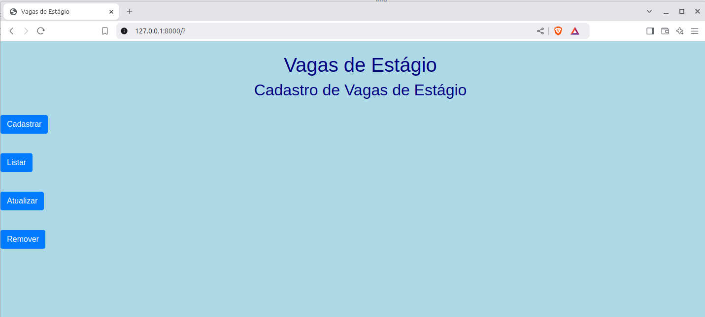
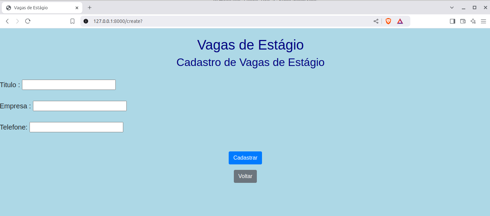
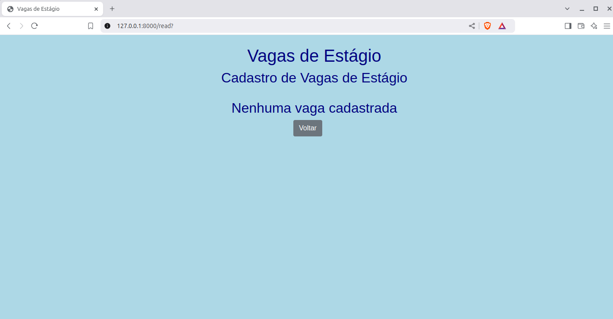
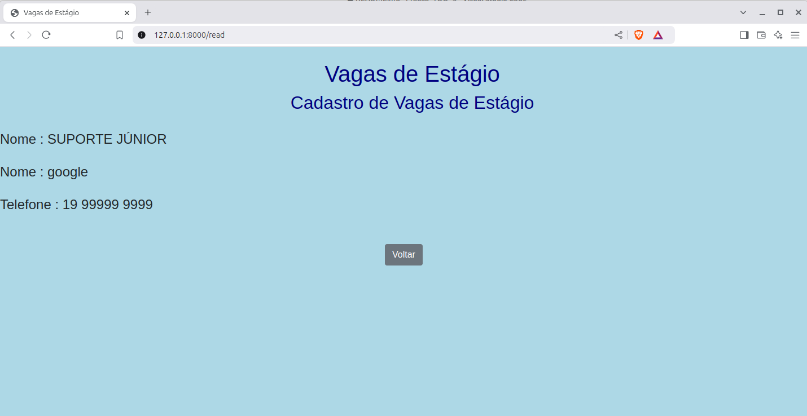
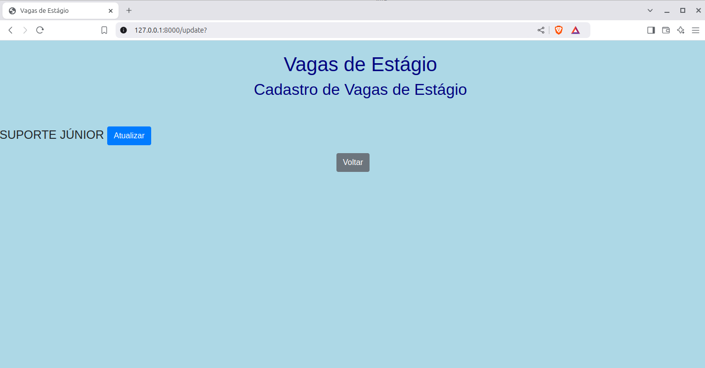
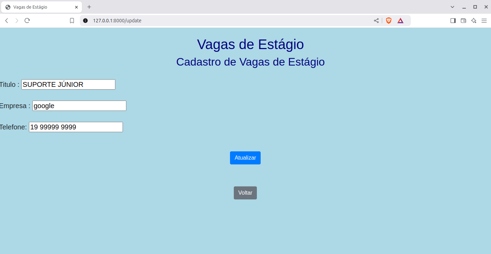
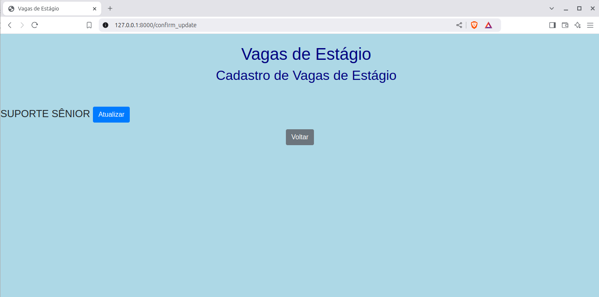
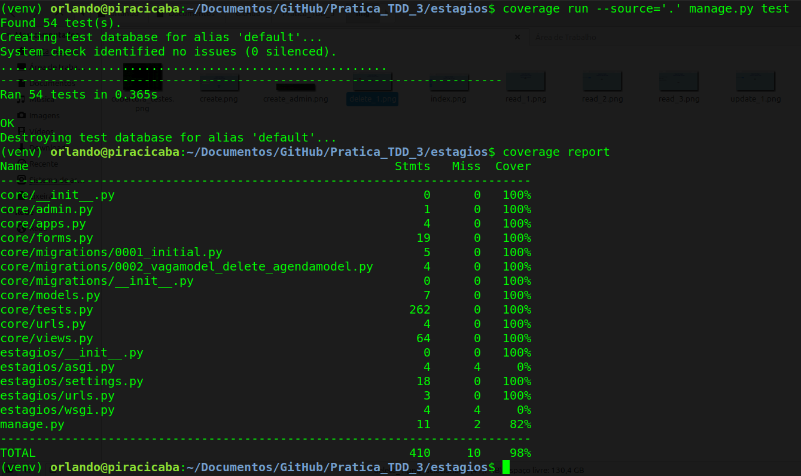

# Prática TDD

Desafio técnico para os alunos da disciplina "Desenvolvimento Web 3"


No ambiente Linux:

```console
git clone https://github.com/orlandosaraivajr/fho_palestra_2025.git
cd fho_palestra_2025/
virtualenv -p python3 venv
source venv/bin/activate
pip install -r requirements.txt
cd codigo/
cd estagios/
python manage.py migrate
python manage.py test
coverage run --source='.' manage.py test 
coverage html
python manage.py runserver
```

No ambiente Windows:

```console
git clone https://github.com/orlandosaraivajr/fho_palestra_2025.git
cd fho_palestra_2025/
virtualenv venv
cd venv
cd scripts
activate.bat
cd ..
cd ..
pip install -r requirements.txt
cd codigo/
cd estagios/
python manage.py migrate
python manage.py test
coverage run --source='.' manage.py test 
coverage html
python manage.py runserver

```

### Requisitos da Sprint 1

O projeto apresenta um cadastro de vagas de estágio. 

Na rota raiz (/), se apresenta quatro botões, conforme imagem abaixo:


Ao acessar a rota cadastro (/create), é possível cadastrar o contato, que armazena as seguintes informações:

- Título
- Empresa
- Telefone



Ao acessar a rota read (/read), Nenhum contato está cadastrado:


Após cadastrar uma vaga, rota listar (/read), lista todas as vagas cadastradas:



Ao acessar a rota update (/update), é possível selecionar e atualizar uma vaga:





Ao acessar a rota delete (/delete), é possível remover um contato:


Todos os testes unitários estão passando, e o sistema funciona como previsto para a primeira sprint.



## Requisitos para a Sprint 2

Aqui começa seu desafio. 


## Novo campo
O cliente deseja armazenar um novo campo:

+ Descritivo da vaga

Adicione um campo do tipo CharField com tamanho máximo de 255 caracteres. Não se esqueça de definir o valor default como ''.

+ E-mail da empresa

Adicione um campo do tipo EmailField. Não se esqueça de definir o valor default como ''.


## Validação dos campos

O cliente deseja ajustes na validação dos campos com as seguintes regras:

+ Descritivo: Espera-se pelo menos 10 caracteres na descrição da vaga.

+ Empresa: Alterar a validação. Mínimo de caracteres serão 2 caracteres. Ao validar, tornar o nome da empresa com o primeiro caracter maiúsculo.

+ Todos os campos serão são obrigatórios.

## Exibir novo campo nos templates

Exibir os campos novos em todos os templates que manipulam dados da vaga.


## Ajustes nos testes

O código fonte passará por atualizações para acomodar estes novos requisitos. Com isso, você deve ajudar os testes existentes e, caso julgue pertinente, criar novos testes.

Você recebeu a sprint 1 com uma cobertura de teste acima de 90%. É esperado que ao final da sprint 2 a cobertura mantenha-se neste patamar.

